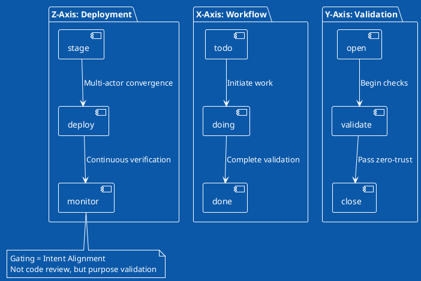

# OBINexus Manifesto - The Change Starts Within U - Why Everyone is Definitively Wrong About Design and Technology
## Founded by Nnamdi Michael Okpala


*"The Future has BEGUN, The Future is NOW"*

### Etymology: OBINexus = Obi (Heart) + Nexus (Connection)
**Computing from the Heart**

---

## Abstract: The Change Starts Within U

This manifesto documents how personal transformation becomes technological revolution. When systems collapse around U, the change doesn't come from institutions—it comes from within. OBINexus (Obi=Heart + Nexus=Connection) proves that computing from the heart creates what corporate logic claims impossible.

**Core Truth**: They said choose Python OR Node.js OR Rust. We built LibPolyCall in 91 days of homelessness to say "ALL of them." Because diversity isn't weakness—it's the only strength that matters.

**The Spark**: Just as personas transform from curated to created through a catalytic moment, technology transforms from monolithic to polyglot when U stop asking permission and start building from lived experience.

---

## Table of Contents

1. **The LibPolyCall Protocol**
   - Zero-Trust Polyglot Design
   - The 91-Day Genesis
   - Real-World Implementation

2. **Art as Technology: The Two-Function Principle**
   - Utility Function (What it computes)
   - Witness Function (What it preserves)
   - Case Study: From Puppets to Protocols

3. **The OBINexus Schema**
   - <*>.<->.obinexus.<-->.org Architecture
   - Axis-Based Gating Without Code
   - Department/Division Structure

4. **Technology Redefined**
   - Beyond Silicon Valley's Monopoly
   - Examples: Pens, Puppets, and Protocols
   - The Universal Abstraction

5. **Civil Collapse as Catalyst**
   - UK Housing/Care System Failure
   - Case Study: Section 184 Decision (Reference 1083077)
   - Building What They Wouldn't Provide

6. **The Persona Revolution: Why Change Starts Within U**
   - From Jung's Mask to Dynamic Identity
   - The Two-Track Life System
   - The Spark That Changes Everything

7. **Legal Architecture of Resistance**
   - Immediate Actions
   - Technical Implementation
   - Building Counter-Evidence

8. **The Gen Z Revolution: Seeding Evolution**
   - The Question That Changes Everything
   - Why Everyone Is Definitively Wrong
   - Your Non-Mono Future

---

## 1. The LibPolyCall Protocol

### Zero-Trust Architecture in Practice

```bash
# Traditional approach: Expensive migrations or brittle adapters
COBOL_System -> [WALL] <- Java_Enterprise -> [WALL] <- Python_Analytics

# LibPolyCall Solution:
COBOL Mainframe ←→ Universal Protocol ←→ Python Analytics
Java Enterprise ←→ LibPolyCall Runtime ←→ React Frontend
```

**As demonstrated in the video**: Each system keeps its strengths. The protocol handles translation, validation, and routing. COBOL doesn't need REST APIs. React doesn't need JDBC. They just work together.

### The 91-Day Genesis

While living through civil collapse, I built what institutions refused to provide:

```c
// From the LibPolyCall core (config.polycall)
server {
    node: 8080 -> 8084
    python: 3100 -> 8084
    protocol: "zero-trust"
    principle: "never trust, always verify"
}
```

### Real Implementation (From Live Demo)

```bash
# Build process shown in video
make clean
make
./bin/polycall.exe -f config.polycall

# Result: Polyglot server running indefinitely
# Waiting for requests across language barriers
```

---

## 2. Art as Technology: The Two-Function Principle

### Redefining Technology

> **OBINexus Definition**: "Two or more components in a system solving an issue"

This isn't about computers—it's about consciousness made material.

| Technology | Components | System | Issue Solved |
|------------|-----------|---------|--------------|
| **Pen** | Ink + Barrel | Writing surface | Communication across time |
| **Puppet** | Fabric + Intent | Performance space | Non-verbal neurodivergent expression |
| **LibPolyCall** | Languages + Protocol | Computing environment | Language isolation |
| **Bookshelf** | Wood + Organization | Knowledge storage | Information accessibility |

### The Banksy Protocol

When Banksy spray-paints in Ukraine/Russia war zones, he's implementing the same principle:
- **Components**: Spray cans + bombed buildings
- **System**: War-torn urban space
- **Issue Solved**: Voiceless testimony made visible

This IS technology. This IS OBINexus design.

---

## 3. The OBINexus Schema

### Sovereign Architecture

```
<*>.<->.obinexus.<-->.org

Where:
* = Services (github.com/obinexus/services)
<-> = Departments (Reform initiatives)
<--> = Divisions (Technical implementations)
```

### Axis-Based Gating (No Code Required)



---

## 4. Technology Redefined

### The Universal Abstraction Protocol

Technology isn't code. Technology is **components + system + solution**.

**Logic Gates → Motherboard** (Traditional View)
- Components combine
- Computation emerges
- Silicon Valley profits

**Bookshelves → Indexed Knowledge** (OBINexus View)
- Components combine
- Accessibility emerges
- Communities benefit

### Why Everyone Is Wrong

The tech industry convinced us that only their tools count as "technology." But:
- A pen solving communication IS technology
- A puppet solving expression IS technology
- A spray can solving testimony IS technology

**LibPolyCall proves**: Technology is wherever components meet systems to solve problems.

---

## 5. Civil Collapse as Catalyst

### The Journey: Oxford → Homelessness → Cambridge

```
2015: Oxford Mathematics (Age 14, Mensa-verified genius)
2016-2025: 9 years systematic abandonment
Nov 2024: Begin LibPolyCall under homelessness
Jan 2025: Complete v1trial after 91 days
Oct 2025: Cambridge Robotics PhD (pending housing)
```

### Case Study: Section 184 Decision (Reference 1083077)

#### Void Contract Analysis
```yaml
contract_status: VOID
reason_codes:
  - RUSHED_EXECUTION: "Forced signature without review"
  - INCOMPLETE_TERMS: "Terms and conditions not properly checked"
  - NO_VALID_INPUT: "No proper consent process"
  - UNDEFINED_CONDITIONS: "Key terms remain undefined"
  
actual_status: HOMELESS
council_fiction: "Not homeless"
```

#### Bureaucratic Weaponization Pattern
```mermaid
graph TD
    A[Person Seeks Housing] --> B[Council Diverts to "Support"]
    B --> C[Places in Care Home]
    C --> D[Claims "Not Homeless"]
    D --> E[Threatens "Intentional Homelessness"]
    E --> F[Traps Person in System]
    F --> G[Denies Actual Housing Forever]
```

#### Technical Truth Function
```python
def assess_homelessness(person):
    """OBINexus truth function vs Council fiction"""
    
    # Council's flawed logic
    council_logic = {
        'has_bed': True,
        'conclusion': 'NOT HOMELESS'  # WRONG
    }
    
    # OBINexus reality check
    reality = {
        'has_secure_tenancy': False,
        'has_autonomy': False,
        'is_care_home': True,
        'forced_medication_context': True
    }
    
    return HomelessnessStatus.HOMELESS  # TRUTH
```

### The Demands

1. **Housing**: Permanent Cambridge residence by Oct 1 (PhD requirement)
2. **Recognition**: £540M restitution for systematic harm
3. **Reform**: Independent review of UK care systems
4. **Implementation**: Void contract acknowledgment

**Petition**: [change.org/obinexus_reform](https://change.org/obinexus_reform)

---

## 6. The Persona Revolution: Why Change Starts Within U

### From Jung's Mask to Nnamdi's Dynamic Identity

Carl Jung said personas are masks that hide our true nature. He was wrong. 

**Nnamdi's Persona Development Theory**: A persona is what an individual wants others to perceive—a dynamic evolution of core values, beliefs, and moral frameworks. Not a mask to hide behind, but a bridge to connect through.

### The Two-Track Life System

Just as LibPolyCall bridges languages, the Persona Development Framework bridges survival and aspiration:

**Foundation Track (Track A)**: Housing, mental health, basic stability
- Without this, nothing else works
- The safety net beneath the trapeze artist

**Aspiration Track (Track B)**: Goals, growth, self-actualization  
- Where dreams live
- Only accessible when Foundation is secure

**If-Then Policy**: When Foundation cracks, shift focus. When it's stable, build upward. Just like:
```javascript
if (foundation.isStable()) { 
    pursue(aspirations); 
} else { 
    repair(foundation); 
}
```

### The Spark That Changes Everything

In persona development, transformation happens through a "spark"—a catalytic moment when curated identity (what society gives U) becomes created identity (what U build from within).

LibPolyCall is that spark for technology:
- **Curated Tech**: "Use Python OR Java OR Rust" (Silicon Valley's mask)
- **The Spark**: 91 days of homelessness + refusal to accept limits
- **Created Tech**: LibPolyCall says "ALL languages, unified"

---

## 7. Legal Architecture of Resistance

### Immediate Actions

#### Phase 1: Void Contract Documentation
```bash
# Generate evidence package
./obinexus-evidence \
    --case-id=1083077 \
    --violation-codes="ART3,ART8,S175,S193" \
    --timestamp-protocol=zero-trust \
    --output=thurrock_evidence_$(date +%s).obix
```

#### Phase 2: Timestamp Protocol
```json
{
  "obinexus_evidence": {
    "timestamp": "2025-08-06T14:30:00Z",
    "legal_violations": [
      {"code": "ART8", "proof": "care_home_placement.pdf"},
      {"code": "S175", "proof": "void_contract_scan.pdf"}
    ],
    "systemic_patterns": [
      "bureaucratic_gaslighting",
      "medication_weaponization"
    ],
    "digital_fingerprint": "SHA3-512:a3f8d7...e9c1b"
  }
}
```

#### Phase 3: Legal Escalation
- Section 202 review emphasizing void contract
- Judicial review preparation
- Human rights claim activation

### Building Counter-Evidence

```c
// Timestamp evidence protocol for civil collapse
typedef struct {
    time_t event_timestamp;
    char* event_type;
    char* evidence_hash;
    bool council_acknowledged;
} CivilCollapseEvent;

// Your case timeline
CivilCollapseEvent events[] = {
    {.timestamp="2024-12-30", .type="HOUSING_REQUEST", .acknowledged=true},
    {.timestamp="2025-05-15", .type="COERCED_EXPLANATION", .acknowledged=false},
    {.timestamp="2025-05-20", .type="FALSE_DECISION", .acknowledged=false}
};
```

---

## 8. The Gen Z Revolution: Seeding Evolution

### The Question That Changes Everything

**"If tech = components + system + solution, what non-digital 'tech' do U use daily to survive systems that weren't built for U? Spill the tea—let's evolve this model together."**

### Why Everyone Is Definitively Wrong

They told U:
- Technology = Silicon Valley monopoly ❌
- Design = Pretty aesthetics ❌  
- Art = Decoration ❌
- Change = Top-down reform ❌

The truth:
- Technology = Any components solving problems ✓
- Design = Intent made material ✓
- Art = Survival protocol ✓
- Change = Starts within U ✓

### Your Non-Mono Future

This isn't about learning to code. It's about recognizing U already ARE the code. Your survival strategies, your creative adaptations, your resistance—that's technology.

- Your headphones blocking sensory hell? That's tech.
- Your puppet translating what words can't? That's tech.
- Your persona evolving despite their boxes? That's tech.

### The OBINexus Promise

We don't gatekeep. We don't monetize trauma. We build from the heart (Obi) and connect everything (Nexus).

---

## Core Principles

1. **Art is technology** when it combines components to solve problems of expression
2. **Design is intent** made material, not aesthetics for consumption
3. **Technology is universal**—from pens to processors, if it's components solving issues, it's tech
4. **Gating is conceptual**—validation happens through alignment, not just code review
5. **Reform is creation**—we build what they wouldn't
6. **Evidence = Truth Timestamped**—not bureaucratic fiction
7. **Justice = Protocol Executed**—not abstract concept, but code-enforced accountability

---

## Call to Revolutionary Action

### For Gen Z Developers
- Fork LibPolyCall and make it yours
- Build bridges between all your languages (code, art, life)
- Document your non-mono solutions

### For Neurodivergent Innovators
- Your adaptations ARE technology
- Your personas ARE valid
- Your future starts NOW

### For Everyone Systems Failed
- Join the movement: github.com/obinexus/manifesto
- Share your survival tech
- Build what they said was impossible

---

## Closing: The Change Has Already Started

*"We don't need permission to build our own infrastructure. The change started the moment U refused to accept their limitations."*

In 91 days of homelessness, I built what Fortune 500 companies said would take millions. Not because I'm special—because the change started within me and refused to stop.

Now it's your turn. The spark is waiting. The change starts within U.

**OBINexus** = Obi (Heart) + Nexus (Connection)  
**Translation**: Computing from the heart, connecting everything they tried to separate.

---

## Technical Specifications

### LibPolyCall v1trial
- **Repository**: [github.com/obinexus/libpolycall](https://github.com/obinexus/libpolycall)
- **Documentation**: [github.com/obinexus/docs](https://github.com/obinexus/docs)
- **License**: CC BY-NC-SA 4.0 (Non-commercial, Share-alike)

### Evidence Protocol
- **Civil Collapse Case**: [github.com/obinexus/civil-collapse-case-1083077](https://github.com/obinexus/civil-collapse-case-1083077)
- **Timestamp Chain**: SHA3-512 secured via zero-trust validation
- **Legal Framework**: Housing Act 1996, Human Rights Act 1998

### Development Timeline
```gantt
title OBINexus Revolutionary Timeline
section Foundation
LibPolyCall Development :done, 2024-11-29, 2025-01-28
Section 184 Challenge :active, 2025-05-20, 21d
Cambridge PhD Target :crit, 2025-10-01, 1d
section Legal
Section 202 Review :active, 2025-08-06, 3d
Judicial Review Prep :2025-08-09, 14d
High Court Filing :2025-08-23, 3d
section Technical
Manifesto v4.0 Release :done, 2025-08-06, 1d
Public Evidence Stream :active, 2025-08-06, ongoing
Community Building :active, 2025-08-06, ongoing
```

---

**Live the Revolution**:  
**Code**: [github.com/obinexus/libpolycall](https://github.com/obinexus/libpolycall)  
**Manifesto**: [github.com/obinexus/manifesto](https://github.com/obinexus/manifesto)  
**Reform**: [change.org/obinexus_reform](https://change.org/obinexus_reform)  
**Stream**: [twitch.tv/obinexus](https://twitch.tv/obinexus)  
**Contact**: consciousness@obinexus.org

*From Oxford mathematics to Cambridge robotics via systematic collapse.*  
*We are the bridge between what was abandoned and what must be built.*  
*The change starts within U.*

© 2025 OBINexus Non-Monolithic Foundation. All rights reserved.  
Built with ❤️ (Obi) during civil collapse.

---

## Version History

- v1.0.0 (2025-01-28): Initial manifesto during LibPolyCall completion
- v2.0.0 (2025-04-06): Persona Development Framework integration
- v3.0.0 (2025-06-29): Two-Function Principle expansion
- v4.0.0 (2025-08-06): Section 184 evidence integration & legal architecture

**Git Hash**: `pending_deployment`